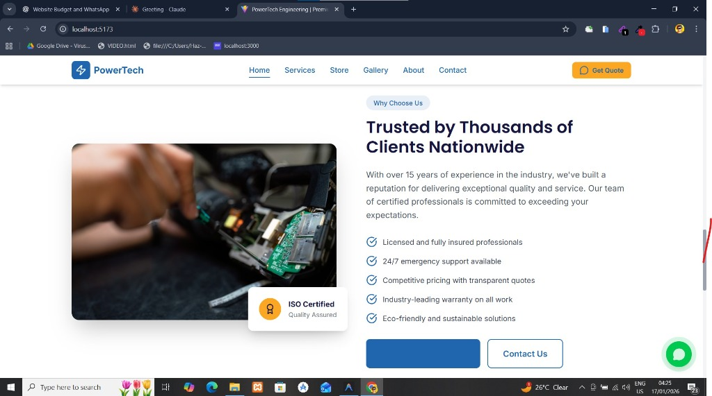

# PowerTech Engineering

A modern, responsive website for PowerTech Engineering - a professional electrical, solar, and smart home solutions provider.



## 🚀 Features

- **Responsive Design** - Fully mobile-optimized with progressive breakpoints
- **Modern UI** - Clean, professional design with smooth animations
- **Hero Carousel** - Auto-playing image slider with overlay text
- **Animated Statistics** - Numbers count up when scrolled into view
- **WhatsApp Integration** - Quick contact via WhatsApp floating button
- **Service Showcase** - Detailed service cards with features
- **Product Store** - Filterable product catalog
- **Contact Page** - Multiple contact methods with business hours

## 🛠️ Tech Stack

- **React 18** - Modern React with hooks
- **TypeScript** - Type-safe development
- **Vite** - Fast build tool and dev server
- **Tailwind CSS v4** - Utility-first styling
- **React Router** - Client-side routing
- **Lucide Icons** - Beautiful icon library

## 📦 Installation

```bash
# Clone the repository
git clone https://github.com/yourusername/powertech.git

# Navigate to client directory
cd powertech/client

# Install dependencies
npm install

# Start development server
npm run dev
```

## 🏗️ Project Structure

```
client/
├── public/          # Static assets
├── src/
│   ├── components/  # Reusable components
│   │   ├── common/  # Button, Card, Carousel, CountUp
│   │   ├── layout/  # Header, Footer, Layout
│   │   └── sections/# Hero, ServiceCard, ProductCard
│   ├── pages/       # Page components
│   ├── routes/      # Route configuration
│   └── index.css    # Global styles & Tailwind config
└── package.json
```

## 🎨 Key Components

### CountUp Animation

Animated number counter that triggers when scrolled into view:

```tsx
<CountUp end={2500} suffix="+" duration={2000} />
```

### Hero Carousel

Responsive image carousel with auto-play and navigation:

```tsx
<Hero slides={heroSlides} />
```

## 📱 Pages

- **Home** - Hero carousel, services preview, stats, CTA sections
- **Services** - Detailed service cards with features
- **Store** - Filterable product catalog
- **Gallery** - Project showcase
- **About** - Company story and values
- **Contact** - Contact methods and WhatsApp CTA

## 🌐 Deployment

```bash
# Build for production
npm run build

# Preview production build
npm run preview
```

## 📄 License

MIT License - feel free to use this project for your own purposes.

---

Built with ❤️ using React, TypeScript, and Tailwind CSS
